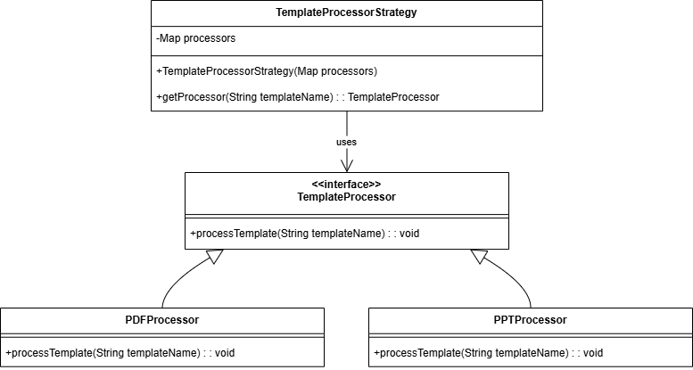
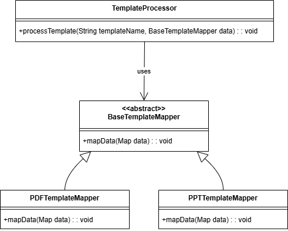
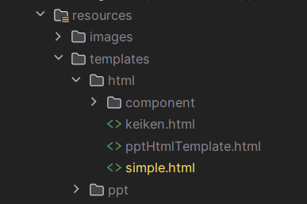
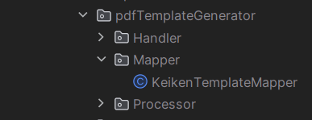
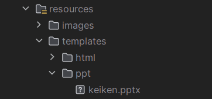
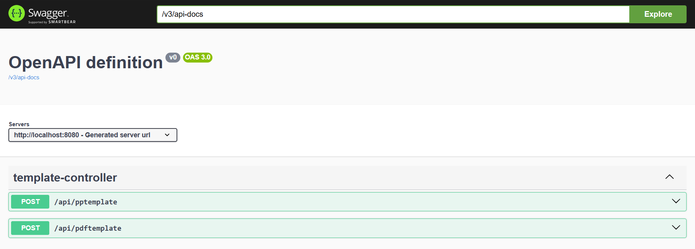
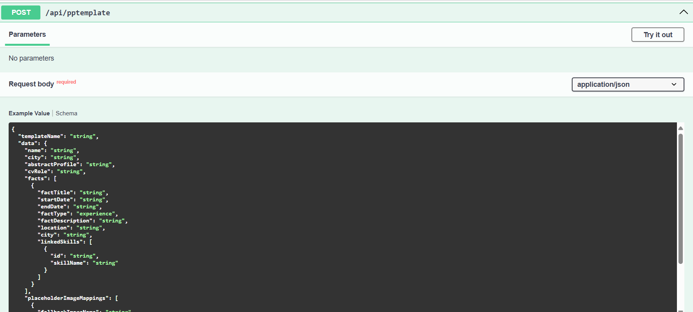

# Objective

The purpose of this documentation is to guide developers and contributors through the various aspects of the project. It aims to provide a comprehensive understanding of the project’s objectives, structure, and the tools used. Readers will gain insights into how to set up, maintain, and extend the project, ensuring they can effectively contribute to or utilize the system.

This documentation will:

- **Explain the Purpose**: Clearly outline the goals of the project and its intended outcomes.
- **Guide Setup and Usage**: Provide detailed instructions on setting up the development environment and using the project’s features.
- **Facilitate Contribution**: Offer guidelines for contributing to the project, including adding new templates and following best practices.
- **Ensure Quality and Consistency**: Present best practices, design patterns, and troubleshooting tips to maintain the project's quality and coherence.

This document serves as a key resource for both new and existing contributors, ensuring that everyone involved has a clear understanding of how to work with and build upon the project.


# Prerequisites

Before you dive into the ResumeBuilder documentation, ensure you have the following prerequisites in place:

### Knowledge and Skills
- **Basic Understanding of Java:** Familiarity with Java programming, including concepts like object-oriented programming and basic syntax.
- **Spring Boot Fundamentals:** Knowledge of the Spring Boot framework, including how to set up and configure a Spring Boot application.
- **Maven:** Build tool for managing project dependencies and building the project.
- **Familiarity with Apache POI:** Understanding of the Apache POI library for manipulating PowerPoint files if working with PowerPoint templates.
- **HTML/CSS Knowledge:** Basic understanding of HTML and CSS if working with PDF conversion from HTML templates.

### Setup Instructions
- **Clone the Repository:** Clone the ResumeBuilder repository from [GitHub](https://github.com/salmaane/resumebuilder).
- **Install Dependencies:** Follow the instructions in the project’s build tool Maven to install required dependencies. you can run the following command to install them: `./mvnw clean install`
- **Configuration:** Update configuration files as necessary to match your local setup or development environment. by default, its working and you need to change nothing.


# Tools We Use

This section provides an overview of the tools and technologies employed in the ResumeBuilder project. Understanding these tools will help you get a better grasp of the project's architecture and implementation.

### Programming Languages and Frameworks
- **Java:** The primary programming language used for developing the application.
- **Spring Boot:** A framework that simplifies the development of Spring-based applications by providing default configurations and built-in features.

### Libraries and Dependencies
- **Apache POI:** A library used for reading and writing Microsoft Office files, including PowerPoint files. It is used for manipulating PowerPoint templates in the project.
- **openHtmlToPdf:** A library that converts HTML and CSS to PDF, used for generating PDF documents from HTML templates.
- **Thymeleaf:** A templating engine used for processing HTML templates and integrating with the PDF generation process.

### Development and Build Tools
- **Maven:** Build tool for managing project dependencies, building and packaging the application.

### Version Control
- **Git:** The version control system used for tracking changes in the source code during development. The project is managed using Git, and the repository is hosted on [GitHub](https://github.com/salmaane/resumebuilder).


# Libraries

This section details the libraries and frameworks used for handling PowerPoint and PDF generation within the ResumeBuilder project.

### PowerPoint Libraries
- **Apache POI:** The primary library used for manipulating PowerPoint files. Apache POI provides support for creating, modifying, and reading Microsoft Office documents, including `.ppt` and `.pptx` formats. It allows for the programmatic manipulation of slides, shapes, and text within PowerPoint presentations, you can find the docs [here](https://poi.apache.org/components/slideshow/).

### PDF Libraries
- **openHtmlToPdf:** A library used for converting HTML and CSS into PDF documents. It supports a wide range of CSS properties and HTML elements, enabling the generation of complex PDF layouts from HTML templates.
- **Thymeleaf:** A templating engine used in conjunction with `openHtmlToPdf` for processing HTML templates. Thymeleaf allows for dynamic content rendering and integration of data into HTML templates before conversion to PDF, you can find the docs [here](https://www.thymeleaf.org/documentation.html)


# Project Structure
```
src
│
├── main
│   ├── java
│   │   └── com.keiken
│   │       ├── config
│   │       │   ├── AppProperties.java
│   │       │   └── ThymeleafConfig.java
│   │       │   
│   │       ├── controller
│   │       │   └── TemplateController.java
│   │       ├── dto
│   │       │   └──  TemplateRequest.java
│   │       ├── mapper
│   │       │   ├── PlaceholderImageMapping.java
│   │       │   └── TemplateBaseMapper.java
│   │       ├── openai
│   │       │   ├── config
│   │       │   │   └── OpenAiConfig.java
│   │       │   ├── dto
│   │       │   │   ├── Message.java
│   │       │   │   ├── OpenAiRequest.java
│   │       │   │   └── OpenAiResponse.java
│   │       │   └── service
│   │       │       ├── OpenAiService.java
│   │       │       ├── OpenAiServiceImpl.java
│   │       │       └── SummaryService.java
│   │       ├── pdfTemplateGenerator
│   │       │   ├── Handler
│   │       │   │   ├── PdfTemplateHandler.java
│   │       │   │   └── PdfTemplateHandlerImpl.java
│   │       │   ├── Mapper
│   │       │   │   └── KeikenTemplateMapper.java
│   │       │   └── Processor
│   │       │       └── PdfTemplateProcessor.java
│   │       ├── pptTemplateGenerator
│   │       │   ├── Handler
│   │       │   │   ├── PPTTemplateHandler.java
│   │       │   │   └── PPTTemplateHandlerImpl.java
│   │       │   ├── Mapper
│   │       │   │   └── KeikenTemplateMapper.java
│   │       │   └── Processor
│   │       │       └── PPTTemplateProcessor.java
│   │       ├── processor
│   │       │   └── TemplateProcessor.java
│   │       ├── service
│   │       │   ├── TemplateService.java
│   │       │   └── TemplateServiceImpl.java
│   │       └── strategy
│   │       │    ├── TemplateMapperStrategy.java
│   │       │    ├── TemplateProcessorStrategy.java
│   │       └──PowerpointtemplateApplication.java
│   └── resources
│       ├── images
│       │   ├── certifications
│       │   ├── clients
│       │   ├── schools
│       │   └── technologies
│       ├── templates
│       │   ├── html
│       │   └── ppt
│       └── application.yml
└── test
    └── java


```
**Explication:** 
- **Config Package:** config Package: Contains configuration class  AppProperties , responsible for application-level settings and third-party integrations , AppProperties class is used to map the values from the .properties file into a strongly-typed Java class. This approach makes it easier to access and manage configuration settings in the code.. 
- **controller Package:** TemplateController class, which handles HTTP requests and routes them to appropriate services.
- **dto Package**: Contains Data Transfer Objects (DTOs) such as TemplateRequest, Message, OpenAiRequest, and OpenAiResponse. These classes are used for transferring data between layers.
- **mapper Package:** Includes classes like PlaceholderImageMapping and TemplateBaseMapper, which are responsible for mapping entities or DTOs to other objects.
- **openai Package**: Encapsulates all classes related to OpenAI integration.
  - **config Package**: Includes configuration for OpenAI.
  - **dto Package**: Holds the DTOs specific to OpenAI requests and responses.
  - **service Package**: Implements the business logic for interacting with OpenAI, with classes like OpenAiService and SummaryService.
- **pdfTemplateGenerator and pptTemplateGenerator Packages:**
  - **Handler Package:** Contains handler classes responsible for managing PDF and PPT templates.
  - **Mapper Package:** Handles mapping logic related to template generation.
  - **Processor Package:** Manages the processing of templates.
- **service Package:** Centralizes service classes like TemplateService and TemplateServiceImpl, managing the core application logic.
- **strategy Package:** Defines strategies for template processing and mapping, allowing for flexible and scalable implementations.
- **Resources Directory (src/main/resources)**
  - **images Folder:** Stores various images categorized by type, including certifications, clients, schools, and technologies.
  - **templates Folder:** Contains template files used for generating content, organized by type such as HTML and PPT.
  - **application.yml:** The primary configuration file for the application, specifying settings for environment, databases, and third-party services.
- **Test Directory (src/test/java)**
  - **Test Packages:** Mirrors the structure of the main Java directory but focuses on unit and integration tests to ensure the robustness and reliability of the code.
## Design Patterns
This section explains the design patterns applied in the ResumeBuilder project, providing insight into the architectural decisions and helping developers understand the structure and behavior of the system.

### Strategy Pattern
- **Description:** The Strategy pattern is used to define a family of algorithms, encapsulate each one, and make them interchangeable. In the ResumeBuilder project, this pattern is applied to manage different template processing strategies, allowing for flexible handling of various templates (e.g., PowerPoint, PDF).
- **Application:** Different mappers and processors are injected into the service classes, enabling the system to choose the appropriate strategy based on the template type.



- **TemplateProcessorStrategy** class holds a map of <bean name, TemplateProcessor> implementations and they are injected via the constructor with spring autowiring and uses it to return  the correct processor based on the template file extension.<br/>
- **TemplateProcessor** interface defines a method processTemplate() that all processors must implement. which in we define all the logic for template processing like placeholders filling etc.<br/>
- **PDFProcessor** and **PPTProcessor** are concrete implementations of the TemplateProcessor interface, each providing their own version of processTemplate().


### Template Method Pattern
- **Description:** The Template Method pattern defines the skeleton of an algorithm in a base class, allowing subclasses to override specific steps without changing the algorithm's structure.
- **Application:** In ResumeBuilder, this pattern is used in processing templates, where the base class (Processors) provides the general workflow, and specific steps like filling placeholders are defined in subclasses (Mappers).



- **TemplateProcessor:** Defines the general workflow for processing templates. It uses an instance of BaseTemplateMapper to map data to the template. The processTemplate() method orchestrates the template processing using the mapper.
- **BaseTemplateMapper:** An abstract class defining the general methods and attributes for mapping data to a template. It provides the structure that all concrete mappers must follow.
- **PDFTemplateMapper** and **PPTTemplateMapper:** Concrete implementations of BaseTemplateMapper that provide specific details for mapping data in PDF and PowerPoint templates, respectively.

## How We Can Collaborate

This section provides guidance on how others can contribute to the ResumeBuilder project and outlines the collaboration process.

### Contribution Guidelines
- **Fork the Repository:** Start by forking the project repository on [GitHub](https://github.com/salmaane/resumebuilder) to your own account.
- **Create a Branch:** Create a new branch for your feature or bugfix. Use descriptive names for your branches (e.g., `feature/add-new-template`, `bugfix/fix-placeholder-issue`).
- **Make Changes:** Implement your changes in the new branch. Ensure that your code adheres to the project's coding standards and includes appropriate comments.
- **Commit Changes:** Commit your changes with a clear and concise message explaining what your changes do.
- **Push to GitHub:** Push your branch to your forked repository on GitHub.
- **Create a Pull Request:** Open a pull request (PR) to the original repository. In the PR description, provide a detailed explanation of your changes and the problem they solve. Link any related issues or discussions.

### Add New PDF/PPT Template
#### PDF Templates
- **Template Design:**
  - Build your PDF template using HTML and CSS. Stick to using `float` and `margin` properties, as CSS features like `flex` are not well-supported by most PDF libraries.
    
- **Mapper Creation:**
  - Develop a new mapper class within the `pdfTemplateGenerator.Mapper` package, or extend an existing mapper to handle specific data binding for your template.
    
- **Thymeleaf Integration:**
  - Gain a solid understanding of Thymeleaf syntax, focusing on how to write conditional statements and loops to dynamically generate content within your PDF template.

#### PPT Templates
- **Template Setup:**
  - Begin by designing the PPT template, including the addition of tables, image placeholders, and text placeholders.
  - Save your template within the `ppt_templates` folder.
    
- **Shape and Mapper Configuration:**
  - Learn about the different shapes available in PowerPoint and create a corresponding mapper to facilitate processing.
  - Review the existing mappers in the `keikenmapper` to understand the implementation of shape processing and how to adapt it to your new template.


### Add New Type of Templates (e.g. Word)

To extend the project and support a new type of template, follow the steps outlined below:


#### 1. Set Up Folder Structure

To add support for a new type of template, such as Word templates, begin by creating the appropriate folder structure. For Word templates, your directory layout should look like this:
```
├── wordTemplateGenerator
│   ├── Handler
│   │   ├── WordTemplateHandler.java
│   │   └── WordTemplateHandlerImpl.java
│   ├── Mapper
│   │   └── KeikenTemplateMapper.java
│   └── Processor
│       └── WordTemplateProcessor.java
```

**Explanation of Folder Structure:**

- **Handler**: Contains classes for handling the processing of Word templates.
  - `WordTemplateHandler.java`: Defines the interface for handling Word templates.
  - `WordTemplateHandlerImpl.java`: Provides the implementation for handling Word templates.

- **Mapper**: Includes classes for mapping data to placeholders in the Word templates.
  - `WordTemplateMapper.java`: Maps data structures to template placeholders.

- **Processor**: Contains classes responsible for processing Word templates.
  - `WordTemplateProcessor.java`: Defines the interface for processing Word templates.

Use this structure to ensure your project is well-organized and modular, making it easier to manage and extend.


### 2. Create a New Mapper Class

Create a new mapper class that extends the `TemplateData` class and is tailored to handle the specific attributes required by your new template type. This class will be responsible for mapping these attributes to placeholders in your template.

```java
public class WordTemplateData extends TemplateData {
    private String title;
    private String author;
    // Other specific fields

    // Getters and setters for each field
}
```
**NOTE:** The creation of a specific mapper is optional. You can work directly with the base mapper.

### 3. Implement the Template Processor

Create a new processor class that implements the `TemplateProcessor` interface. This class will contain the logic required to process your new template type, such as filling in placeholders or manipulating the document's structure.

```java
@Component("docx")
public class WordTemplateProcessor implements TemplateProcessor<WordTemplateData> {

    @Override
    public void processTemplate(WordTemplateData data) {
        // Logic to process the Word template
    }
}
```
**NOTE:** you should specify the new template type extension as bean name in the processorTemplate implementation.
This ensures that the application can correctly identify and process the new template type based on its file extension.


## Reporting Issues
- **Open an Issue:** If you encounter a bug or have a feature request, open an issue on the [GitHub Issues page](https://github.com/salmaane/resumebuilder/issues). Provide as much detail as possible, including steps to reproduce the issue or a clear description of the feature request.
- **Discussion:** Engage in discussions on open issues or pull requests. Collaboration and constructive feedback are key to improving the project.

## Documentation Contributions
- **Improve Documentation:** If you find any gaps or areas for improvement in the documentation, please contribute by editing the relevant `.md` files or suggesting changes.
- **Add Examples:** Contributions that include practical examples, tutorials, or use cases are especially helpful for new users of the project.

## Project Endpoints
- **Open Swagger UI in The Browser using the  :** [localhost:port/swagger-ui](http://localhost:8080/swagger-ui/index.html#/)

- so we can see all the endpoints with the json attributes:  


## Running the Project Using Docker

To run the project using Docker, follow these steps:

### Prerequisites

- Docker must be installed. [Download Docker](https://www.docker.com/get-started) if needed.

### Build and Run

1. **Build the Project:**

   Before building the Docker image, ensure you have built the project using Maven:

    ```bash
    ./mvnw clean package
    ```

2. **Build the Docker Image:**

    ```bash
    docker build -t resumebuilder .
    ```

3. **Run the Docker Container:**

    ```bash
    docker run -d -p 8080:8080 --name resumebuilder-container resumebuilder
    ```

4. **Access the Application:**

   Open `http://localhost:8080` in your web browser.


### Manage Docker Container

- **Stop the Container:**

    ```bash
    docker stop resumebuilder-container
    ```

- **Remove the Container:**

    ```bash
    docker rm resumebuilder-container
    ```

This setup allows you to run the project in a Docker container efficiently.


## Advice
- **Modularize Your Code:** When adding new features or making modifications, strive to keep the code modular. Use interfaces and design patterns where appropriate to ensure that each module or component has a clear responsibility.
 Avoid creating monolithic classes that handle multiple responsibilities, as this can lead to maintenance challenges.
- **Manage Resources Efficiently:** Pay attention to resource management, especially when dealing with file handling, database connections, or external API calls. Always ensure that resources are properly closed or released to prevent memory leaks.
   Use the appropriate exception handling strategies to deal with potential failures in a graceful manner.
- **Plan for Scalability:** As your project grows, consider how it will scale in terms of performance, maintainability, and complexity. Design your system with scalability in mind from the start to avoid costly refactoring later on.
- **Consistent Team Communication**: Importance: Ongoing communication within the development team ensures alignment and helps resolve issues quickly.
